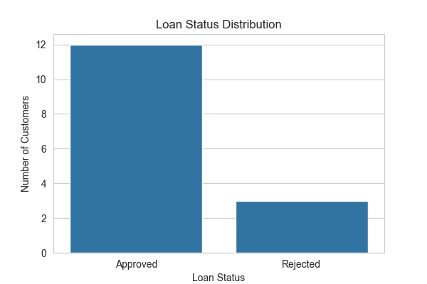
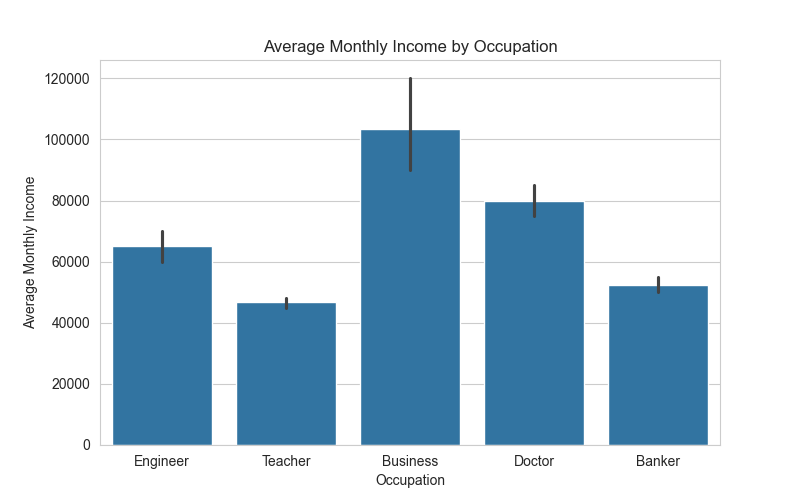
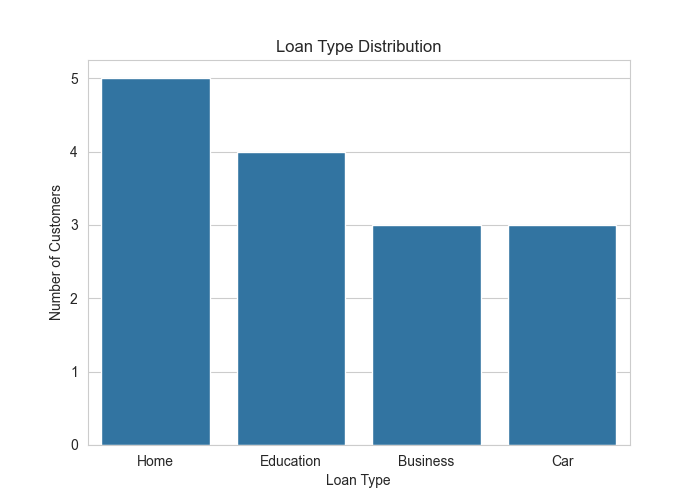
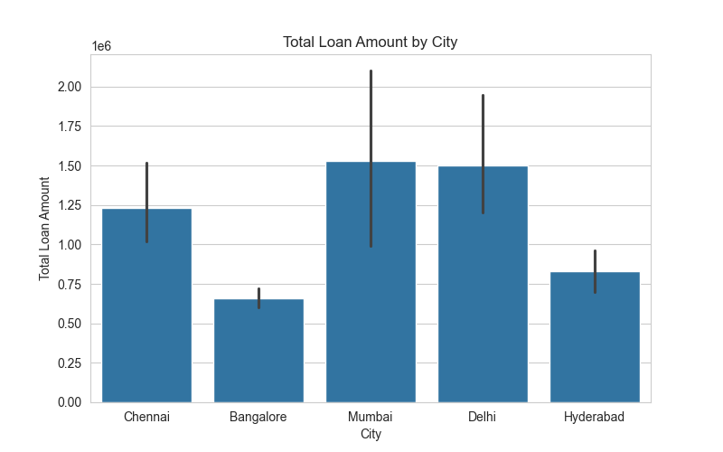
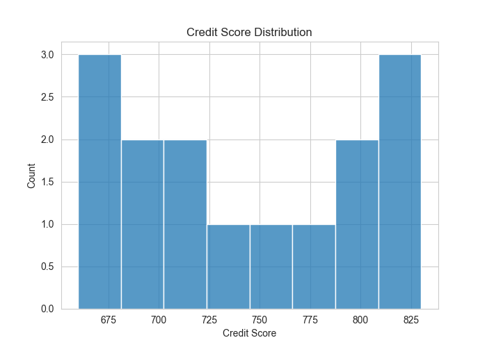
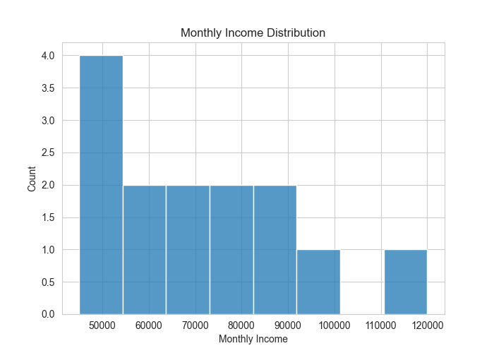
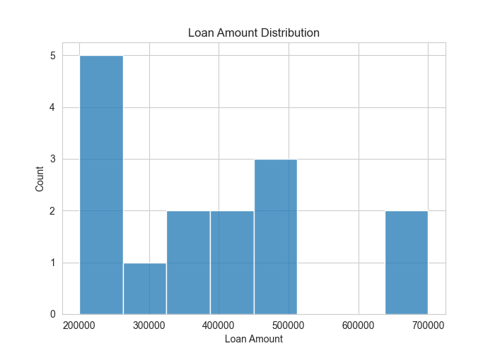
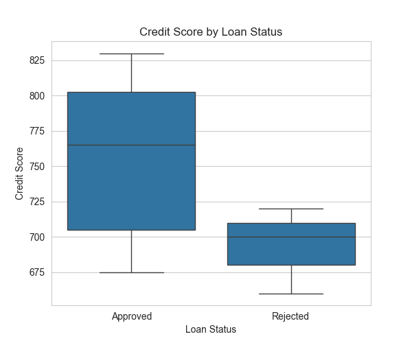
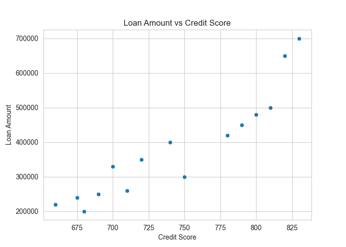
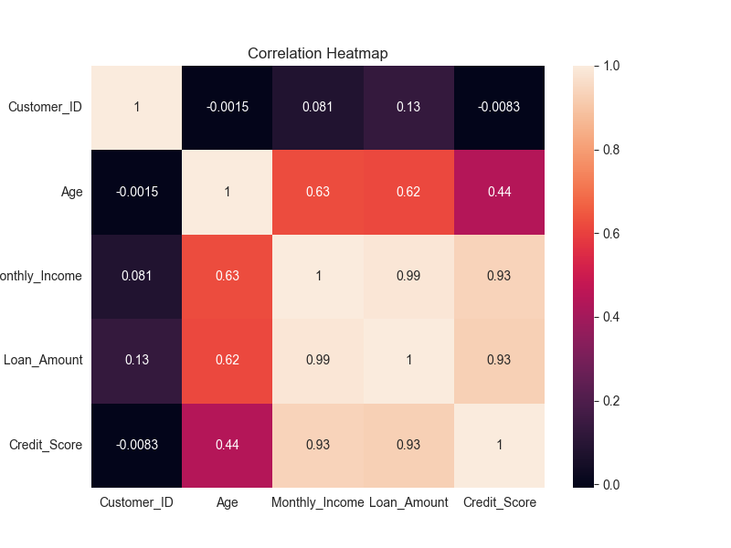

#  Bank Loan Analysis System using Pandas

A real-world **Bank Loan Analysis** project built using **Python, Pandas, Matplotlib, and Seaborn**. This project demonstrates the complete data analysis workflow—from data creation and cleaning to feature engineering, business analysis, and professional data visualization.

---

##  Project Overview

Banks receive thousands of loan applications every day. Analyzing customer information helps financial institutions evaluate applicants, understand customer behavior, identify lending risks, and make informed business decisions.

In this project, we analyze customer loan data to uncover meaningful insights through data analysis and visualization.

---

## Objectives

- Explore and understand customer loan data.
- Clean and preprocess missing values.
- Create new business-related features.
- Analyze customer income, loan amount, and credit score.
- Identify loan approval trends.
- Visualize business insights using professional charts.

---

##  Technologies Used

- Python
- Pandas
- NumPy
- Matplotlib
- Seaborn

---

##  Project Structure

```text
25_Bank_Loan_Analysis/
│
├── figures/
│   ├── average_monthly_income_by_occupation.png
│   ├── correlation_heatmap.png
│   ├── credit_score_by_loan_status.png
│   ├── credit_score_distribution.png
│   ├── loan_amount_distribution.png
│   ├── loan_amount_vs_credit_score.png
│   ├── loan_status_distribution.png
│   ├── loan_type_distribution.png
│   ├── monthly_income_distribution.png
│   └── total_loan_amount_by_city.png
│
├── 01_bank_loan_analysis.py
├── 02_visualization.py
└── README.md
```

---

#  Dataset Information

The dataset contains customer details such as:

- Customer ID
- Name
- Age
- City
- Occupation
- Monthly Income
- Loan Amount
- Loan Type
- Credit Score
- Loan Status

---

#  Data Cleaning

The following preprocessing steps were performed:

- Checked dataset information
- Identified missing values
- Filled missing Age using Mean
- Filled missing Monthly Income using Median
- Checked duplicate records

---

#  Feature Engineering

The following business features were created:

- Annual Income
- Loan-to-Income Ratio
- Risk Level
- Loan Recommendation

---

#  Business Analysis Performed

- Loan Recommendation Summary
- Average Monthly Income by Occupation
- Average Credit Score by Loan Status
- Total Loan Amount by City
- Loan Type Distribution
- Average Loan Amount by Loan Type
- Average Age by Loan Status
- Top 5 Customers by Loan Amount
- Customer with Highest Credit Score
- Customer with Lowest Credit Score

---

#  Visualizations

## 1️⃣ Loan Status Distribution



---

## 2️⃣ Average Monthly Income by Occupation



---

## 3️⃣ Loan Type Distribution



---

## 4️⃣ Total Loan Amount by City



---

## 5️⃣ Credit Score Distribution



---

## 6️⃣ Monthly Income Distribution



---

## 7️⃣ Loan Amount Distribution



---

## 8️⃣ Credit Score by Loan Status



---

## 9️⃣ Loan Amount vs Credit Score



---

## 🔟 Correlation Heatmap



---

#  Key Insights

- Business professionals have the highest average monthly income.
- Teachers have the lowest average monthly income.
- Most loan applications were approved.
- Business loans have the highest average loan amount.
- Customers with higher credit scores are more likely to receive loan approval.
- Chennai and Mumbai contribute significantly to the total loan amount.
- Credit score shows a positive relationship with loan approval.
- Feature engineering helps derive meaningful business metrics such as risk level and loan recommendation.

---

#  Skills Demonstrated

- Data Cleaning
- Exploratory Data Analysis (EDA)
- Feature Engineering
- Business Analysis
- Data Visualization
- Statistical Analysis
- Pandas
- NumPy
- Matplotlib
- Seaborn

---

#  Learning Outcomes

Through this project, I learned how to:

- Work with structured datasets using Pandas.
- Handle missing values effectively.
- Engineer meaningful business features.
- Perform real-world business analysis.
- Build insightful visualizations using Matplotlib and Seaborn.
- Organize a professional Data Analytics project for GitHub.

---

##  Author

**Nithya Sree**

Aspiring Data Scientist | Python | SQL | Pandas | NumPy | Data Visualization